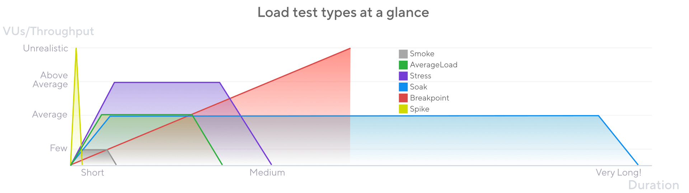

# Types de test de charge

Beaucoup de choses peuvent mal tourner lorsqu'un système est sous charge. Le système doit exécuter de nombreuses opérations simultanément et répondre à différentes demandes d'un nombre variable d'utilisateurs. Pour se préparer à ces risques de performance, les équipes utilisent des tests de charge.

Mais une bonne stratégie de test de charge nécessite plus que l'exécution d'un seul script. Différents modèles de trafic créent différents profils de risque pour l'application.

Les principaux types sont les suivants. Chaque type a son propre article décrivant ses concepts essentiels.

| type | VUs/Throughput | Durée | Quand ? |
| --- | --- | --- |--- |
| Smoke | Bas | Court (secondes)  ou minutes | Lorsque le système ou le code de l'application concerné change. Il vérifie la logique fonctionnelle, les mesures de base et les écarts |
| Load | Production moyenne | Moyen (5-60 minutes) | Souvent pour vérifier que le système maintient la performance avec une utilisation moyenne |
| Stress | Élevé (au-dessus de la moyenne) | Moyen (5-60 minutes) | Quand le système peut recevoir des charges supérieures à la moyenne pour vérifier comment il gère |
| Soak | Moyenne | Longue (heures) | Après des changements pour vérifier le système sous une utilisation continue prolongée |
| Spike | Très élevé | Court (quelques minutes) | Lorsque le système se prépare à des événements saisonniers ou reçoit des pics de trafic fréquents |
| Breakpoint | Augmente jusqu'à la rupture | Aussi longtemps que nécessaire | Quelques fois pour trouver les limites supérieures du système |

## Recommandations

### Commencez par un smoke

Commencez par un smoke test. Avant de commencer des tests plus importants, vérifiez que vos scripts fonctionnent comme prévu et que votre système fonctionne bien avec quelques utilisateurs.

Une fois que vous savez que le script fonctionne et que le système répond correctement à une charge minimale, vous pouvez passer aux tests de charge moyenne. À partir de là, vous pouvez progresser vers des modèles de charge plus complexes.

## Les spécificités dépendent de votre cas d'utilisation

Les systèmes ont différentes architectures et différentes bases d'utilisateurs. En conséquence, la bonne stratégie de test de charge dépend fortement du profil de risque de votre organisation. Évitez de penser en absolus.

Par exemple, k6 peut modéliser la charge par le nombre de VU ou par le nombre d'itérations par seconde (ouvert vs fermé). Lorsque vous concevez votre test, considérez quel modèle a du sens pour le type.

De plus, aucun type de test unique n'élimine tous les risques. Pour évaluer les différents modes d'échec de votre système, intégrez plusieurs types de test. Le profil de risque de votre système détermine les types de tests à mettre en avant :

Certains systèmes sont plus à risque d'être utilisés plus longtemps, auquel cas les trempages devraient être prioritaires.
D'autres sont plus à risque d'utilisation intensive, auquel cas les tests de stress devraient avoir la priorité.
Dans tous les cas, aucun test unique ne peut découvrir tous les problèmes.

De plus, les catégories elles-mêmes sont relatives aux cas d'utilisation. Un test de résistance pour une application est un test de charge moyenne pour une autre. En effet, il n'existe même pas de consensus sur les noms de ces types de tests (chacun des sujets suivants fournit des noms alternatifs).

## Visez des conceptions simples et des résultats reproductibles

Bien que les spécificités dépendent grandement du contexte, ce qui est constant, c'est que vous voulez obtenir des résultats que vous pouvez comparer et interpréter.

Tenez-vous-en à des schémas de chargement simples. Pour tous les types de tests, les directions suffisent : montée en puissance, plateau, rampe descendante.

Évitez les séries de "rollercoaster" où la charge augmente et diminue plusieurs fois. Ceux-ci gaspilleront des ressources et rendront difficile l'isolement des problèmes.
