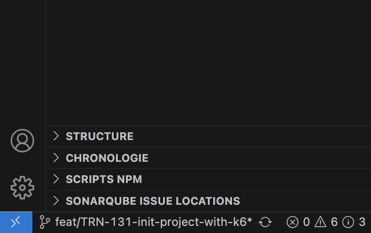
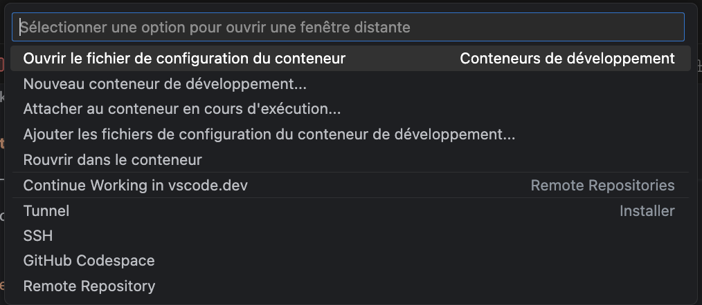

# k6 load testing


[K6 Official Documentation](https://k6.io)

A load testing tool

## Table of contents

- [k6 load testing](#k6-load-testing)
  - [Table of contents](#table-of-contents)
  - [Quick start](#quick-start)
    - [Docker is needed to create and manage your containers](#docker-is-needed-to-create-and-manage-your-containers)
    - [Install the extensions](#install-the-extensions)
    - [Start container](#start-container)
  - [Install manuel](#install-manuel)
    - [Install node with nvm (recommended use)](#install-node-with-nvm-recommended-use)
    - [Install with homebrew](#install-with-homebrew)
  - [Documentation](#documentation)
  - [Usage](#usage)
    - [K6](#k6)
  - [Structure](#structure)
  - [Code Quality and Formatting](#code-quality-and-formatting)
  - [Maintenance](#maintenance)
  - [Link](#link)

## Quick start

### Docker is needed to create and manage your containers

Download and install [Docker Desktop](https://www.docker.com/products/docker-desktop/), or an alternative [Docker option](https://code.visualstudio.com/remote/advancedcontainers/docker-options), like Docker on a remote host or Docker compliant CLI.

Run the Docker Desktop application to start Docker and check docker version.

```bash
docker --version # Should print "Docker version 27.4.0, build bde2b89"
```

### Install the extensions

The Dev Containers extension lets you run Visual Studio Code inside a Docker container.

[ms-vscode-remote.remote-containers](https://marketplace.visualstudio.com/items?itemName=ms-vscode-remote.remote-containers)

Check installation



### Start container

All the necessary tools are included in the dev container.



Use `Reopen in container.`

## Install manuel

### Install node with nvm (recommended use)

```bash
# Download and install nvm:
curl -o- https://raw.githubusercontent.com/nvm-sh/nvm/v0.40.1/install.sh | bash

# Download and install Node.js:
nvm install 22

# Verify the Node.js version:
node -v # Should print "v22.13.1".
nvm current # Should print "v22.13.1".

# Verify npm version:
npm -v # Should print "10.9.2".

# Download and install K6 with homebrew:
brew install k6

# Verify k6 version:
k6 --version # Should print "k6 v0.56.0"

# Install dependencies project
npm install
```

### Install with homebrew

```bash
# Download and install Homebrew
curl -o- https://raw.githubusercontent.com/Homebrew/install/HEAD/install.sh | bash

# Download and install Node.js:
brew install node@22

# Verify the Node.js version:
node -v # Should print "v22.13.1".

# Verify npm version:
npm -v # Should print "10.9.2".

# Download and install K6:
brew install k6

# Verify k6 version:
k6 --version # Should print "k6 v0.56.0"

# Install dependencies project
npm install
```

## Documentation

Use command `npm run doc:serve` and open the link to view the documentation or use your editor `./docs`.

## Usage

### K6

Create new scenario

```bash
mkdir scenarios/my-service && k6 new scenarios/my-service/example.js
```

Run k6

```bash
k6 run scenarios/my-service/example.js
```

Add VUs with dashboard

```bash
K6_WEB_DASHBOARD=true K6_WEB_DASHBOARD_EXPORT=html-report.html k6 run --vus 10 --duration 30s scenarios/my-service/example.js
```

Available command K6

```bash
k6 run --help
```

```bash
Examples:
  # Run a single VU, once.
  k6 run script.js

  # Run a single VU, 10 times.
  k6 run -i 10 script.js

  # Run 5 VUs, splitting 10 iterations between them.
  k6 run -u 5 -i 10 script.js

  # Run 5 VUs for 10s.
  k6 run -u 5 -d 10s script.js

  # Ramp VUs from 0 to 100 over 10s, stay there for 60s, then 10s down to 0.
  k6 run -u 0 -s 10s:100 -s 60s:100 -s 10s:0
```

[see references cli](https://grafana.com/docs/k6/latest/using-k6/k6-options/reference/)

## Structure

```bash
.
├── scenarios
│   └── service-<name>
│      ├── smoke-test-<test summary>.js
│      └── stress-test-<test summary>.js
├── samples (tutorials)
│   ├── average-load-testing.js
│   ├── breakpoint-test.js
│   ├── smoke-test.js
│   ├── soak-test.js
│   ├── spike-test.js
│   └── stress-test.js
│
└── docs
```

## Code Quality and Formatting

Useful commands :

```bash
# Lint
npm run check

# Format
npm run format
```

## Maintenance

A modern cli tool that keeps your deps fresh [taze](https://github.com/antfu/taze#readme)

```bash
npm run deps:update
```

## Link

- [K6](https://grafana.com/docs/k6/latest/)
- [jsDocs](https://jsdoc.app)
